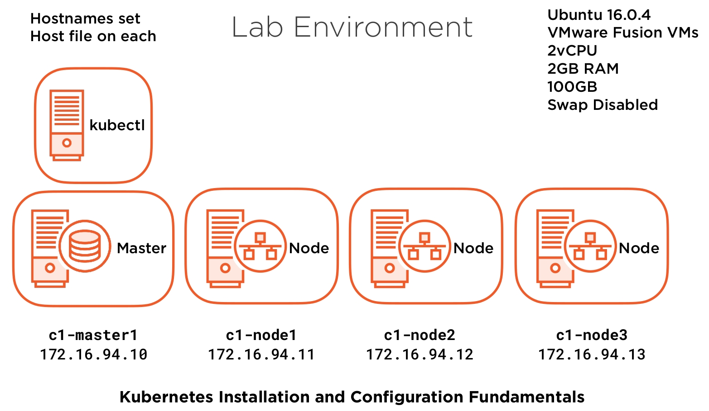

# Networking


## kind setup

```
kind create cluster --name networking --config=setup/kind-config.yaml
kubectl apply -f https://docs.projectcalico.org/v3.9/manifests/calico.yaml
```

## Demos
* [CSI demo](csi-demo/readme.md)