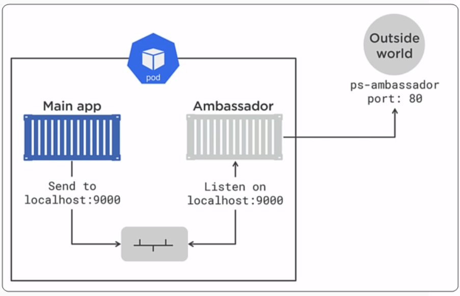

# Ambassador pattern

## External system
This is an app exposed at port 80.
- kubectl create -f exernal.yaml
- kubectl get svc
- http://localhost/
- kubectl get pods

## Our system
This system consists of two containers, the first containers (main-app) just curl on localhost:9000.
While the second one container (ambassador) listen to port 9000 and forward the request to the external system.

## Structure

## Run